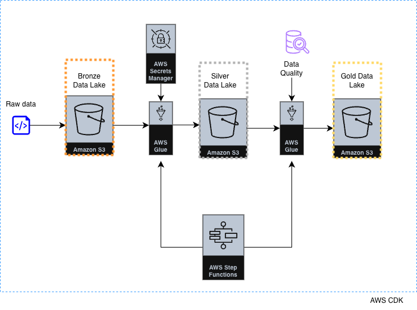
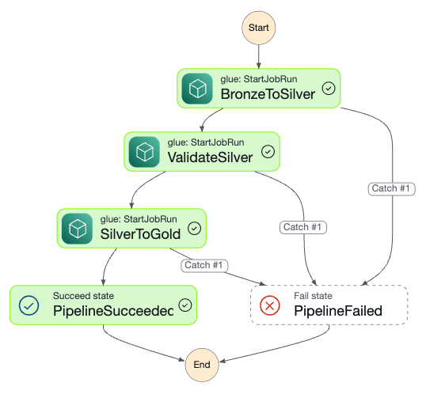

# CDK — Transactions Data Pipeline

A AWS CDK (Python) project that builds a medallion-architecture data pipeline for synthetic South African financial transaction data, with POPIA-compliant data minimisation and automated orchestration via AWS Step Functions. This project is motivated by the work presented on this blog - [*Building a Modern Data Engineering Architecture on AWS with Databricks*](https://hamidpmp.medium.com/building-a-modern-data-engineering-architecture-on-aws-with-databricks-639781d8f4ab)

## Architecture



A Python Faker generator produces synthetic SA banking transactions in NDJSON format, landing raw files into a Bronze S3 bucket. AWS Step Functions orchestrates three sequential AWS Glue PySpark jobs,  Bronze to Silver ETL, Silver data quality validation and Silver to Gold aggregation, writing the final analytical outputs as Parquet to a Gold S3 bucket. AWS Secrets Manager holds the SHA-256 hashing salt used for pseudonymisation and the entire infrastructure is provisioned as code using AWS CDK in Python.

### CDK Stacks

| Stack | Purpose |
|---|---|
| `StorageStack` | Creates Bronze, Silver and Gold S3 buckets and uploads raw transaction data |
| `EtlStack` | Creates the Glue ETL role, script bucket, Secrets Manager salt and three PySpark Glue jobs |
| `OrchestrationStack` | Defines the Step Functions state machine that orchestrates the three Glue jobs in sequence with retry and catch logic |

## Step Functions workflow



Each Glue job is configured with:
- Step Functions waits for completion before proceeding
- `Retry` on `Glue.ConcurrentRunsExceededException` 
- `Catch` on `States.ALL` → `PipelineFailed` terminal state

## Key components

- **`faker_generator.py`** — generates 10,000 synthetic South African bank transactions (NDJSON) with realistic channels, categories, amounts and PII fields
- **`scripts/glue/bronze_to_silver.py`** — PySpark Glue job that reads raw NDJSON from Bronze, applies POPIA data minimisation, hashes sensitive fields using a salted SHA-256 secret from Secrets Manager, and writes partitioned Parquet to Silver
- **`scripts/glue/validate_silver.py`** — PySpark Glue job that validates the Silver partition against completeness, allowed value sets, format integrity, business rules and conditional nullability checks. Fails the job and halts the pipeline if any check fails, writing a JSON validation report to the Gold bucket
- **`scripts/glue/silver_to_gold.py`** — PySpark Glue job that performs aggregations on settled transactions from the Silver layer and writes date-partitioned Parquet to the Gold layer
- **`gold_datalake_analysis.ipynb`** — notebook for interactive validation of Gold data locally

## POPIA compliance

Personal information is treated at the point of Bronze → Silver transformation. No PII reaches the Silver or Gold layers. The SHA-256 salt is auto-generated by AWS Secrets Manager at deploy time. The Glue job fetches it at runtime via `boto3`.


## Gold aggregations

The `silver_to_gold.py` job produces eight analytical datasets in the Gold layer.


## Data quality checks

The `ValidateSilverJob` runs 30+ checks across five categories:

| Category | Examples |
|---|---|
| Completeness | `transaction_id`, `amount`, `account_number` are never null |
| Allowed values | `status` ∈ {SETTLED, PENDING, REVERSED, FAILED} · `currency` ∈ {ZAR, USD, EUR, …} |
| Format / regex | `transaction_id` matches `TXN-YYYYMMDD-*` · `account_number` is 64-char SHA-256 hex |
| Business rules | `amount >= 0` · `transaction_id` is unique · ATM transactions are always DEBIT |
| Conditional nullability | `merchant_name` populated for POS only · `beneficiary_account_number` null for ATM |

A JSON validation report is written to `s3://gold-bucket/validation-reports/year=.../month=.../day=.../` on every run.

---

## Prerequisites

- Python 3.9+
- Node.js (for AWS CDK CLI)
- AWS CDK v2: `npm install -g aws-cdk`
- AWS credentials configured: `aws configure`


## Setup

```bash
# Create and activate virtualenv
python3 -m venv .venv
source .venv/bin/activate        

# Install dependencies
pip install -r requirements.txt

# Bootstrap your AWS environment
cdk bootstrap
```

## Generate synthetic data

```bash
python faker_generator.py
```

---

## Deploy

```bash
cdk synth        # preview CloudFormation templates
cdk deploy --all # deploy all three stacks
```


## Run the pipeline

Trigger the Step Functions state machine manually from the AWS console or CLI. Monitor execution in the AWS Step Functions console to see the visual workflow.

---

## Teardown

```bash
cdk destroy --all
```

---

## Project structure

```
.
├── app.py                              # CDK app entry point
├── cdk_workshop/
│   └── cdk_workshop_stack.py           # StorageStack, EtlStack, OrchestrationStack
├── scripts/
│   └── glue/
│       ├── bronze_to_silver.py         # PySpark ETL — Bronze → Silver
│       ├── validate_silver.py          # PySpark validation — Silver quality checks
│       └── silver_to_gold.py           # PySpark aggregation — Silver → Gold
├── data/
│   └── bronze/                         # Raw NDJSON (generated locally)
│   
├── faker_generator.py                  # Synthetic SA banking data generator
├── gold_datalake_analysis.ipynb        # Interactive notebook
└── requirements.txt
```

---

## Future work

- **EventBridge trigger** — automate pipeline execution on S3 object creation in Bronze
- **Glue Data Catalog** — register Silver and Gold tables for Athena SQL access
- **SNS alerting** — notify on pipeline failure via Step Functions Catch block
- **Machine Learning Modelling** — model patterns such as fraud indicators
